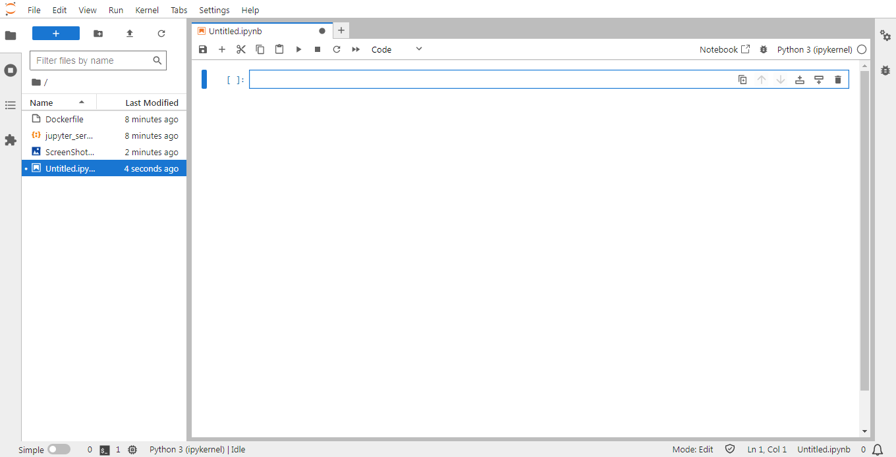

# JupyterLab in Gitpod
This project provides a Docker image for running JupyterLab with remote access enabled especially for Gitpod. It is based on the Gitpod workspace-full image, providing a comprehensive development environment. It includes Python3, pip, and JupyterLab.



## Features

- **JupyterLab**: The image comes pre-installed with JupyterLab, a powerful interactive development environment for Python.

- **Remote Access**: Remote access to JupyterLab is enabled, allowing you to access your Jupyter environment from any device.
  
## Current Status
- Works Perfectly Fine
- Latest Version
- Will be updated if required

## Usage

### Method 1
1. Just click the button to open to run in Gitpod:<br><br>
[](https://gitpod.io/#https://github.com/rijj1/JupyterLab_in_Gitpod)

2. In the terminal where you have the container running, enter `jupyter lab`, and Android Studio should start in the browser tab.
3. Go to the 8888 port and use `rijj1` as the password.

### Method 2
1. Just run the command in the terminal:
````bash
docker run -it --rm -p 8888:8888 rijj1/jupyterlab:v1.0
````
2. In the terminal where you have the container running, enter `jupyter lab`, and Android Studio should start in the browser tab.
3. Go to the 8888 port and use `rijj1` as the password.

